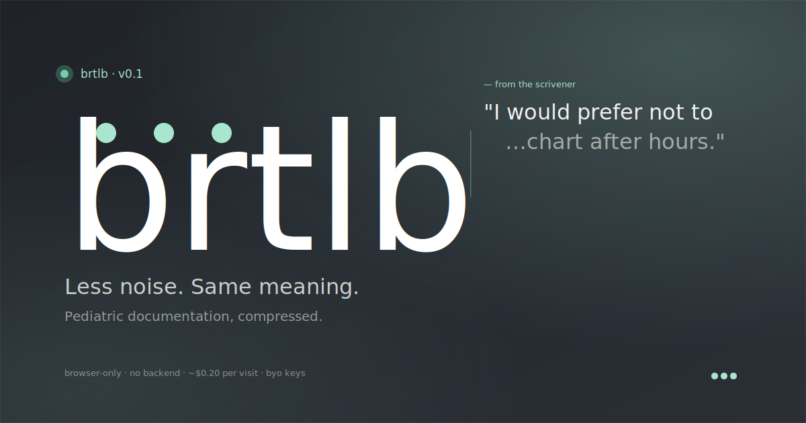

<p align="center">
  
</p>

# brtlb

> A pediatric AI scribe that runs **entirely in your browser** — bring your own keys, your audio never touches our servers, because we don't have any.

[](LICENSE)
[](https://brtlb.vercel.app)
[](#status)

**Live at:** https://brtlb.vercel.app · **Docs site:** https://brtlb.vercel.app/docs

---

## What it does

Tap one button. Speak with your patient. Get a SOAP-style note in ~30 seconds. Paste it into your EHR. That's the loop.

- **Diarization-first ambient capture** — separates clinician, parent(s), and child(ren) on a single mic, with multi-patient splitting for sibling visits.
- **Pediatric-tuned** — 9 visit-type templates (WCV, sick visit, ADHD, behavioral, developmental eval, med check, sports physical, lactation, mental health). Pediatric vocabulary throughout ("acute otitis media," not "ear infection").
- **Long-visit ready** — up to 90 minutes of transcription per visit. Chunked save to IndexedDB so a tab crash mid-recording doesn't lose audio. Chapter markers for visits ≥30 min.
- **BYO keys, BYO BAAs** — AssemblyAI for transcription, Google Gemini (default) / OpenAI / Azure for note generation. Your keys live in your browser's localStorage; brtlb never sees them.
- **No backend in your data path** — audio goes browser → AssemblyAI directly; transcript goes browser → your LLM directly. brtlb has no server holding PHI. Vercel hosts static app code only.
- **Auto-delete on completion** — after pulling the transcript, brtlb fires `DELETE /v2/transcript/{id}` so AssemblyAI's vendor-side retention drops from days to seconds.
- **PWA** — installable on iOS, Android, and desktop. Same code path everywhere. Works offline once loaded (you still need network for STT + LLM calls).

## Quick start (users)

1. Open **https://brtlb.vercel.app**.
2. Run the **onboarding wizard** when prompted — it walks you through getting an AssemblyAI key, a Google Gemini key, and **live-verifies both** (real auth check + a generate-content probe) before your first visit. ~5 minutes.
3. Tap **Record visit**.

For the HIPAA/BAA path most practices want, see [`docs/BAAs.md`](docs/BAAs.md). For the manual key walkthrough, see [`docs/SETUP.md`](docs/SETUP.md). For the full feature tour, see [`docs/USING_BRTLB.md`](docs/USING_BRTLB.md) or the [docs site](https://brtlb.vercel.app/docs).

## Quick start (developers)

```bash
nvm use                              # picks up .nvmrc
corepack enable                      # pnpm
pnpm install
pnpm --filter @brtlb/web-mvp dev     # http://localhost:5180
```

Run all checks:

```bash
pnpm format:check && pnpm lint && pnpm typecheck && pnpm test
```

The app deploys to `brtlb.vercel.app` on every push to `main`.

## Architecture in one paragraph

brtlb is a static SPA. Audio captured by `MediaRecorder` is persisted in chunks to IndexedDB (`audio_chunks`) so a tab crash mid-visit doesn't lose data. On stop, the audio uploads to AssemblyAI directly from the browser, the transcript polls back, then the LLM generates a SOAP-style note. Notes, transcripts, settings, and a 200-entry audit log all live in IndexedDB + localStorage. Vercel hosts the app code only — never sees PHI. Each device + browser context is its own data island; no cross-device sync.

Deeper design docs live in [`docs/`](docs/) — see the table below.

## Privacy & data handling

- **PHI never reaches a brtlb-controlled server.** There isn't one. The host (Vercel) serves static JS/CSS/HTML; analytics is cookieless page-views only.
- **Vendor BAAs are your responsibility.** brtlb makes the recommended path easy: AssemblyAI BAA (5-min DocuSign) + your existing Google Cloud HIPAA BAA. Full decision tree in [`docs/BAAs.md`](docs/BAAs.md).
- **Auto-delete on the vendor side.** Each transcript is deleted from AssemblyAI immediately after pulling it. Toggle in Settings → Privacy & Security.
- **Local-first by default.** Notes, transcripts, settings, and audit log live in your browser. No account, no cloud sync, no cross-device replication. Each browser is its own island.
- **API keys redacted from logs.** brtlb redacts AssemblyAI / Gemini / OpenAI key patterns from any text it writes to the in-app audit log (see `apps/web-mvp/src/lib/redact.ts`).

## Documentation

**User-facing** (live, browseable):

- [Features](https://brtlb.vercel.app/docs/features.html) · [Why brtlb](https://brtlb.vercel.app/docs/why.html) · [Customize](https://brtlb.vercel.app/docs/customize.html) · [Troubleshoot](https://brtlb.vercel.app/docs/troubleshoot.html) · [FAQ](https://brtlb.vercel.app/docs/faq.html)

**In this repo:**

| Path                                  | Purpose                                                                |
| ------------------------------------- | ---------------------------------------------------------------------- |
| [`docs/SETUP.md`](docs/SETUP.md)                                       | Manual key setup walkthrough (wizard alternative).                      |
| [`docs/BAAs.md`](docs/BAAs.md)                                         | HIPAA / Business Associate Agreement decision tree.                     |
| [`docs/USING_BRTLB.md`](docs/USING_BRTLB.md)                           | Full feature tour, in the order you'll discover them.                   |
| [`docs/failure-modes.md`](docs/failure-modes.md)                       | Catalog of failure scenarios + remediation status.                      |
| [`docs/personalization-pipeline.md`](docs/personalization-pipeline.md) | How visit-type templates and personalization compose.                   |
| [`docs/design-diarization-banners.md`](docs/design-diarization-banners.md)       | Diarization UX and confidence-banner design.                  |
| [`docs/design-silence-lock-interaction.md`](docs/design-silence-lock-interaction.md) | Auto-stop on silence + screen-lock behavior.             |
| [`docs/design-speaker-recovery.md`](docs/design-speaker-recovery.md)   | LLM-assisted speaker-label recovery for merged clusters.                |
| [`docs/marketing-copy.md`](docs/marketing-copy.md)                     | Source copy for the landing page (verbatim claims, no embellishment).   |

## Repo layout

| Path                  | Purpose                                                       |
| --------------------- | ------------------------------------------------------------- |
| `apps/web-mvp`        | The product. React 19 + Vite 6 + Tailwind v3 PWA.             |
| `apps/electron`       | Desktop shell (paused)                                        |
| `apps/mobile`         | Capacitor config (paused)                                     |
| `packages/pipeline`   | LLM adapters, AssemblyAI client, prompt composer              |
| `packages/db`         | Schema interface + SQLite impl (used by future native shells) |
| `packages/ui`         | Shared React components (Lockup, Button, marks)               |
| `packages/prompts`    | Versioned visit-type templates and patterns                   |
| `eval-fixtures/`      | Synthetic regression fixtures for prompts (no PHI tracked)    |
| `site/assets/`        | README banner + social-card SVGs                              |

## Status

**Pre-1.0.** brtlb is in active use by its author's pediatric DPC practice and is openly available to other practices who want to try it. Expect rough edges, occasional prompt iteration, and no SLA. The clinical safety story (red-flag handling, hallucination guardrails) is taken seriously and continuously evaluated, but **you are the clinician of record** — every generated note requires your review before it goes in the chart.

## Contributing

Issues and PRs welcome. A few ground rules:

- **Never include PHI in an issue, PR, log, or commit.** Use synthetic transcripts only.
- For prompt or pipeline changes, include a synthetic fixture under `eval-fixtures/synthetic-*/` demonstrating the before/after behavior.
- Keep changes scoped — small PRs land faster.

There is no CLA at this time. By contributing, you agree your contribution is licensed under AGPL-3.0.

## Security

If you find a security or privacy issue, **please do not file a public issue.** Email **michael@hobbs.md** with details and steps to reproduce. PGP available on request.

## License

[AGPL-3.0](LICENSE). If you host a modified version of brtlb as a network service, you must offer the corresponding source to your users.
